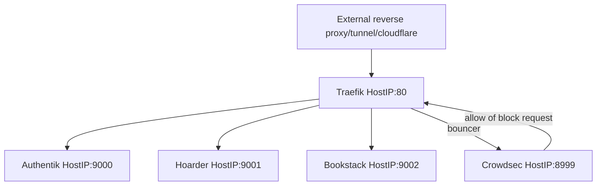

## Homelab infra

Example homelab config using podman and quadlets.

```mermaid
flowchart TD
    source[External reverse proxy/tunnel/cloudflare]
    crowdsec[Crowdsec HostIP:8999]
    traefik[Traefik HostIP:80]
    auth[Authentik HostIP:9000]
    hoarder[Hoarder HostIP:9001]
    bookstack[Bookstack HostIP:9002]

    source --> traefik
    traefik --> auth
    traefik --> hoarder
    traefik --> bookstack
    traefik -->|bouncer| crowdsec
    crowdsec -->|allow of block request| traefik
```

### Getting started

1. Clone this repository
2. Create symlink to systemd directory in your home.
3. Start quadlets.

